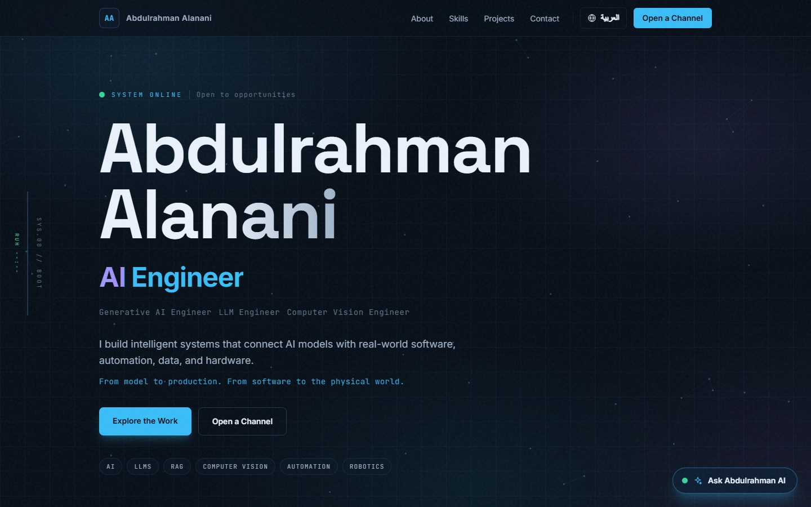

# Abdulrahman Alanani — AI Engineer Portfolio

**Live: [anani.online](https://anani.online)**

A bilingual (EN/AR) portfolio that behaves like a live AI system — boot-sequence hero, telemetry spine, an interactive skills map wired to real project evidence, a 3D drone mission control, and a fully grounded RAG assistant that answers questions about Abdulrahman with citations, in Arabic or English.



> From model to production. From software to the physical world.

## Highlights

- **RAG chatbot** — build-time TF-IDF index over curated knowledge documents, in-memory cosine retrieval, DeepSeek streaming with source citations, persona modes (Recruiter / Engineer / Student), prompt-injection-resistant, rate-limited, chat history persistence
- **3D drone mission control** — React Three Fiber scene with exploded-view subsystems and a live fire-detection simulation (graceful 2D fallback on low-power devices)
- **Skills intelligence map** — every skill node links to the projects where it was actually used
- **Interactive architecture walkthroughs** — animated pipelines for the AL ROUF AI platform (n8n + FastAPI + bilingual RAG) and the fire-detection drone
- **Full EN ⇄ AR** — RTL layout mirroring, Arabic typography, pre-hydration locale restore
- **Engineering honesty** — verified metrics only (mAP@50 ≈ 0.824, ROC AUC ≈ 0.886), documented limitations

## Stack

Next.js 16 (App Router) · TypeScript · Tailwind CSS v4 · Framer Motion (LazyMotion) · React Three Fiber · DeepSeek API · Vercel

## Quick start

```bash
npm install
cp .env.example .env   # add DEEPSEEK_API_KEY (server-side only)
npm run dev            # http://localhost:3000
```

Production:

```bash
npm run build
npm start
```

## Rebuilding the RAG knowledge base

The assistant answers only from curated markdown sources in `src/kb/documents/`. After editing them:

```bash
node scripts/build-kb.ts
```

This re-chunks every document and regenerates the sparse TF-IDF vectors committed in `src/kb/kb.json` — no external vector database or build-time services required.

## Deployment

Deployed on **Vercel** (auto-deploys on push to `main`).

1. Import the repo in Vercel
2. Add environment variable `DEEPSEEK_API_KEY`
3. *(optional)* `NEXT_PUBLIC_SITE_URL=https://anani.online`
4. Deploy

## Security notes

- API keys are server-side only — the browser never sees them
- Strict CSP, HSTS, X-Frame-Options, Referrer-Policy, Permissions-Policy via `next.config.ts`
- Chat endpoint: per-IP rate limiting, 2000-char input cap, grounded answers with explicit refusal when information is unavailable

## Structure

```
src/
├── app/            # App Router: page, layout, /api/chat, /api/cv, SEO routes
├── components/     # Hero, SkillsMap, ProjectsLab, DroneSection (+ drone/ 3D),
│                   # HowIThink, BuildWithMe, Journey, chat/, SignalSpine …
├── content/data.ts # Bilingual entities: skills graph, pipelines, journey, certs
├── i18n/           # en/ar dictionaries + LanguageProvider (RTL)
├── kb/             # documents/ (RAG sources) + kb.json (generated index)
└── lib/            # retrieval, useChat, tokenize, sound, visitor, use3d
scripts/build-kb.ts # KB chunker + indexer
```

## Contact

- **LinkedIn:** [abdulrahman-alanani](https://linkedin.com/in/abdulrahman-alanani)
- **GitHub:** [aalanani2000](https://github.com/aalanani2000)
- **Email:** aalanani.2000@gmail.com
